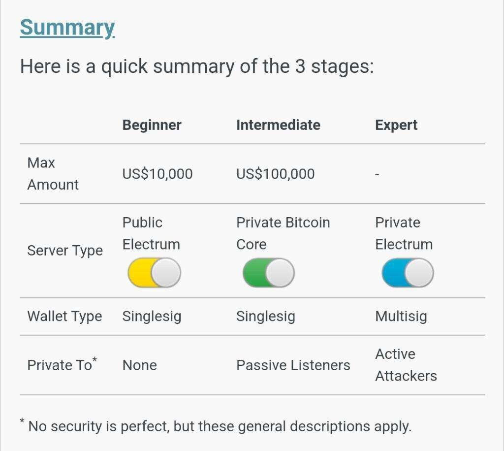

> [!CAUTION]
> Do not share your seed phrase with anyone, ever. Don't enter it into many devices and, if possible, don't type it into a device directly connected to the internet.

> Bitcoin is different things to different people.  
> — Jameson Lopp

Whatever Bitcoin is to you and wherever you are in your Bitcoin journey, the San Diego Bitcoiners are here for you! Born out of the Covid pandemic at a time when Bitcoiners needed to get back to rubbing elbows, this meetup set out to serve as a means to gather folks who were interesting in talking and learning about Bitcoin, and _only_ Bitcoin!

Take a look at our events page to see when we're meeting next. Our current cadence is the second Thursday of the month at [Quantum Brewing](https://www.quantumbrewingsd.com/) in Kearny Mesa. We have guest presentations, short demos, and sometimes just hang out and chat with each other.

## Community


  
  
  


## Sparrow's Three Stages

[Sparrow Wallet](https://sparrowwallet.com/) (our favorite desktop wallet) is a great resource for self-custodying your bitcoin in a secure and private way. Check out their [Best Practices](https://sparrowwallet.com/docs/best-practices.html) section. This information is great for new people and seasoned Bitcoiners.  They propose 3 general stages based on the value of your Bitcoin savings:

  

Which stage are you in? Are you ready to optimize or graduate to the next one and need help? Check out our  page.

## Our Friends

There are several other Bitcoin meetup groups we are friendly with. Check them out too!
* [Encinitas](https://lu.ma/calendar/cal-3zDGZ6vPHuIqgAO)
* Pacific Beach (TBD)
* [Escondido](https://lu.ma/calendar/cal-7fsYTR7N4Yfc6Ed)

For more information, visit [Hextra](https://imfing.github.io/hextra).
