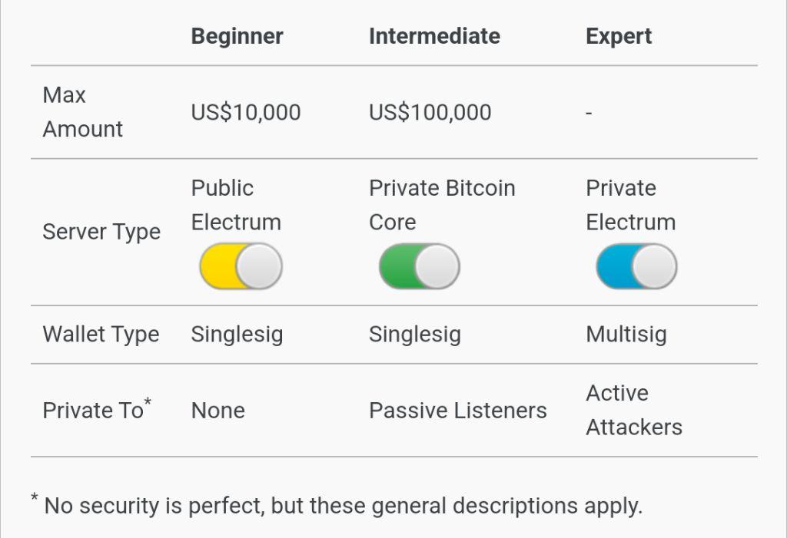

## Sparrow's Three Stages

[Sparrow Wallet](https://sparrowwallet.com/) (our favorite desktop wallet) is a great resource for self-custodying your bitcoin in a secure and private way. Check out their [Best Practices](https://sparrowwallet.com/docs/best-practices.html) section. This information is great for new people and seasoned Bitcoiners.  They propose 3 general stages based on the value of your Bitcoin savings:

  

Which stage are you in? Are you ready to optimize or graduate to the next one and need help? Check out our [Support](/support) page.
